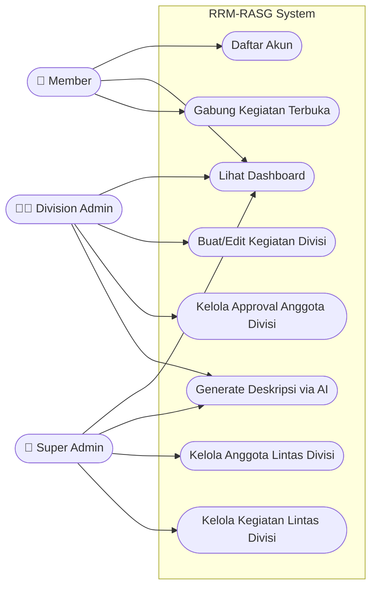
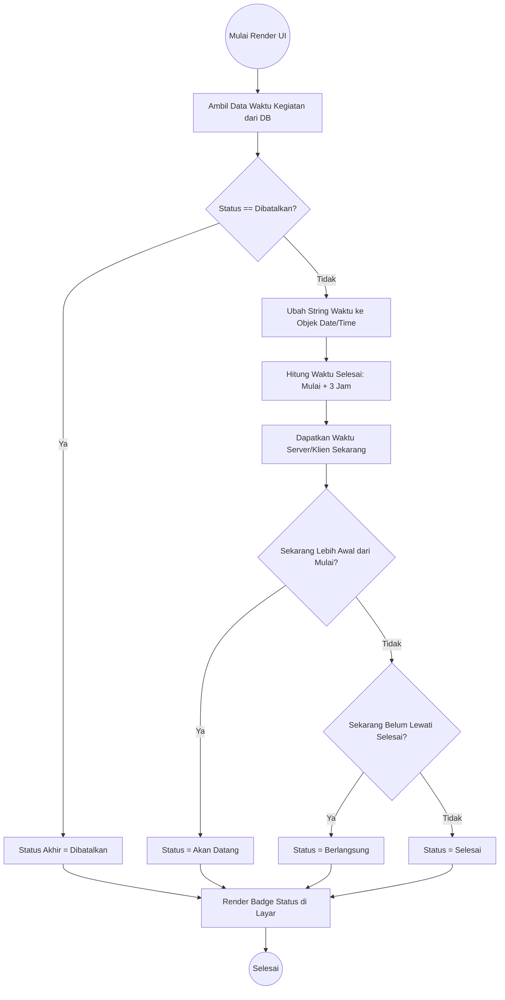
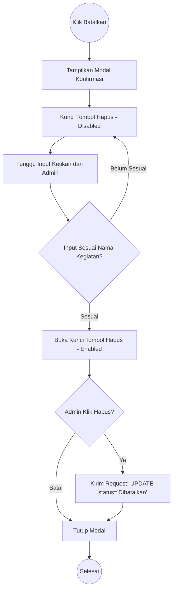
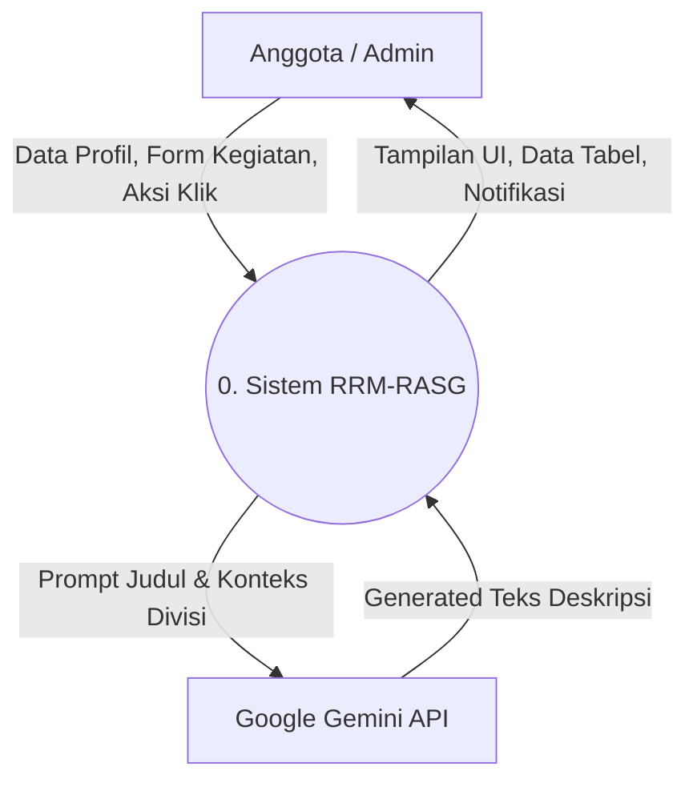
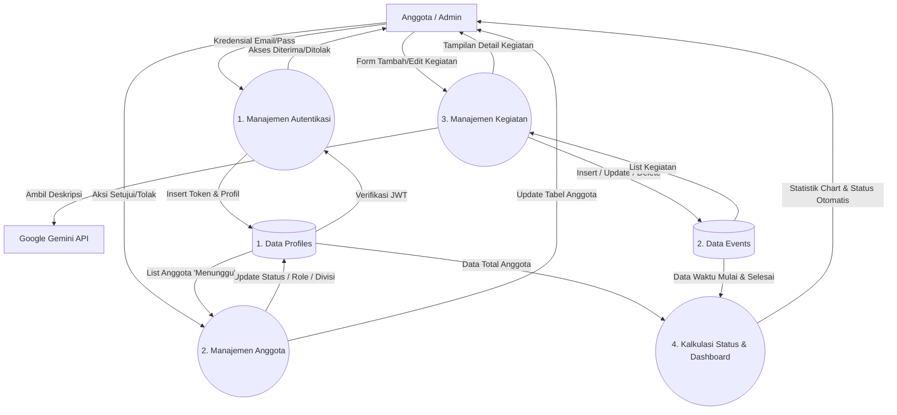
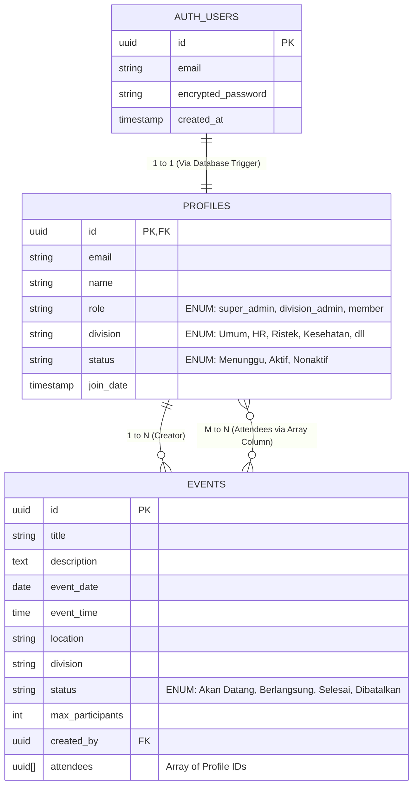
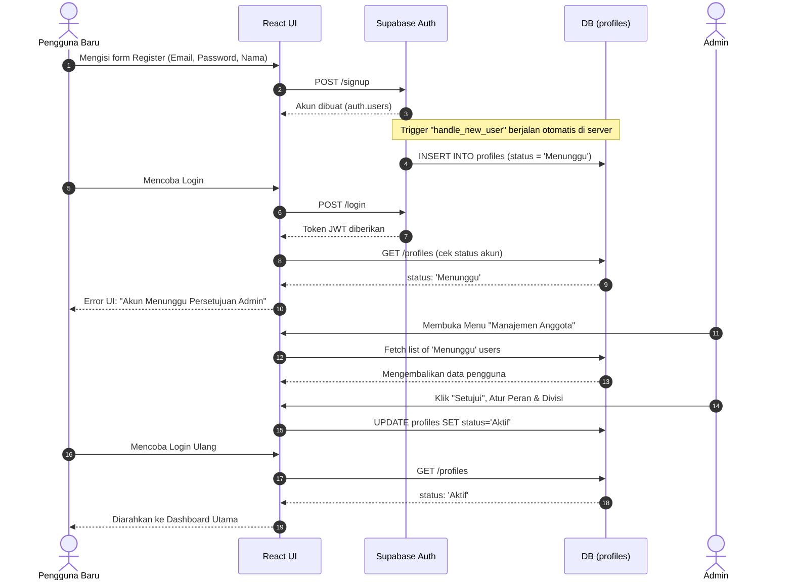
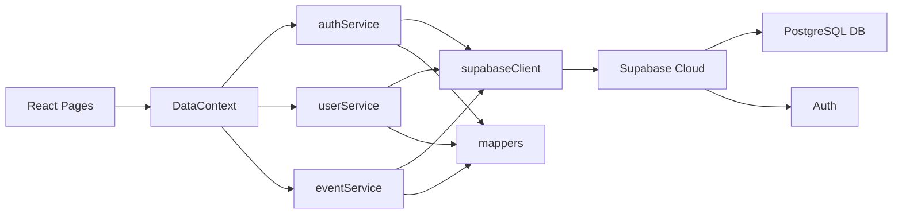

# **Product Requirement Document \- PRD**

**Mata Kuliah:** Analisis Perancangan Sistem Informasi

**Nama Proyek:** RRM-RASG (Sistem Manajemen Relawan & Kegiatan Rumah Amal Salman Garut)

**Versi:** 1.0-release

**Tanggal:** 14 Juni 2026

## **Identitas Tim**

| No | Nama Lengkap | NIM | Peran (Role) | Tanggung Jawab Utama |
| :---- | :---- | :---- | :---- | :---- |
| 1 | Akmal Maulana | 2407040 | Project Manager & System Analyst | Merancang PRD, Arsitektur Basis Data, Validasi Alur Bisnis (RBAC), Koordinasi Dokumentasi (UML & DFD). |
| 2 | Vicky Andika Irwanto | 2407044 | UI/UX & Front End Developer | Mengembangkan antarmuka interaktif dengan React/Vite, TailwindCSS, State Management, & Visualisasi Data (Recharts). |
| 3 | Ripandi Gunawan | 2407038 | Database & Backend Integrator | Konfigurasi Supabase, Perancangan Skema PostgreSQL, Implementasi Row Level Security (RLS), & Integrasi Google Gemini AI. |

## **1\. Pendahuluan**

### **1.1 Latar Belakang**

Organisasi kerelawanan berskala besar seperti Rumah Amal Salman Garut (RASG) sering menghadapi masalah dalam memantau anggota yang tersebar di berbagai divisi. Pengelolaan data yang tersentralisasi namun tetap mengisolasi wewenang masing-masing admin divisi menjadi sebuah tantangan. Selain itu, kegiatan organisasi seringkali kekurangan dokumentasi deskriptif yang baik. Oleh karena itu, Sistem RRM-RASG dikembangkan sebagai platform *Serverless* modern yang memadukan manajemen basis data aman (Row Level Security) dengan kecerdasan buatan (Gemini AI) untuk mengotomatisasi deskripsi acara.

### **1.2 Tujuan Proyek**

Membangun ekosistem perangkat lunak yang mampu mengelola siklus hidup keanggotaan dan acara secara dinamis, memastikan integritas data lintas divisi melalui *Role-Based Access Control* (RBAC) pada tingkat basis data, serta mengotomatisasi pembuatan *copywriting* kegiatan menggunakan modul *Generative AI*.

### **1.3 Ruang Lingkup (Scope)**

* **In-Scope:** Registrasi dan *approval* akun anggota, pemisahan hak akses berbasis Divisi (Umum, HR, Ristek, dll), penjadwalan acara dengan kalkulasi status waktu *real-time*, perlindungan RLS (Row Level Security), dan modul AI *Text Generation* terisolasi untuk deskripsi acara.  
* **Out-of-Scope:** Sistem ini tidak memproses transaksi finansial (donasi/zakat), pembukuan kas organisasi, absensi menggunakan biometrik/QR Code, atau manajemen aset/inventaris fisik.

## **2\. Target Pengguna (User Persona)**

* **Aktor 1: Super Admin:** Memiliki otorisasi absolut melintasi batas divisi. Bertanggung jawab mengelola seluruh anggota (termasuk memindahkan divisi anggota), membatalkan kegiatan dari divisi manapun, dan memiliki divisi khusus (`Umum`) yang tidak mengotori statistik dashboard utama.
* **Aktor 2: Manajer Divisi (Division Admin):** Memiliki hak akses eksklusif yang dikunci hanya pada divisinya. Dapat menyetujui (approve) atau menolak anggota baru di divisinya, serta merancang dan mengelola kegiatan spesifik untuk divisinya saja.
* **Aktor 3: Anggota (Member):** Akses standar (*consumer*). Dapat melihat metrik partisipasinya di Dashboard, menelusuri katalog kegiatan yang sedang/akan berlangsung, dan mendaftarkan diri ke sebuah kegiatan.

## **3\. Kebutuhan Sistem (System Requirements)**

### **3.1 Kebutuhan Fungsional (Functional Requirements)**

| ID | Fitur | Deskripsi | Prioritas |
| :---- | :---- | :---- | :---- |
| **FR-01** | Autentikasi & Approval | Registrasi akun via Supabase Auth. Akun baru masuk ke status `Menunggu` dan tidak dapat login hingga disetujui Admin. | High |
| **FR-02** | Manajemen Anggota Lintas Divisi | Super Admin dapat mengatur seluruh anggota. Admin Divisi hanya dapat melihat/memodifikasi anggota divisinya. | High |
| **FR-03** | Manajemen Kegiatan & Status Real-Time | Admin dapat membuat kegiatan. Status kegiatan (`Akan Datang`, `Berlangsung`, `Selesai`) dihitung otomatis berdasarkan waktu saat ini. | High |
| **FR-04** | Konfirmasi Tindakan Keamanan | Pembatalan/penghapusan kegiatan secara permanen memerlukan *input text* manual dari nama kegiatan untuk mencegah *human error*. | Medium |
| **FR-05** | Integrasi Gemini AI | Sistem menyediakan tombol Generate AI untuk menyusun deskripsi kegiatan secara otomatis berdasarkan Judul & Divisi. | High |

### **3.2 Kebutuhan Non-Fungsional (Non-Functional Requirements)**

| ID | Kategori | Deskripsi / Parameter Kebutuhan | Metrik Target |
| :---- | :---- | :---- | :---- |
| **NFR-01** | *Security (Data Isolation)* | Sistem diwajibkan menggunakan PostgreSQL Row Level Security (RLS) untuk memblokir kueri API asing yang mencoba melintasi batas Divisi. | 100% Data Terisolasi |
| **NFR-02** | *Performance & UI/UX* | Aplikasi di-render menggunakan arsitektur Single Page Application (SPA) agar transisi halaman terjadi tanpa *reload*. | \< 500 ms / Navigasi |
| **NFR-03** | *Availability* | Menggunakan *Backend-as-a-Service* (BaaS) Supabase dan Vercel agar tidak perlu memelihara server fisik. | 99.9% Uptime |
| **NFR-04** | *Data Integrity* | Menghindari penggunaan tabel *junction* berlebih; menggunakan PostgreSQL `Array` untuk menyimpan referensi peserta kegiatan. | Efisiensi Kueri |

## **4\. Pemodelan Sistem (System Modeling)**

### **4.1 UML Use Case Diagram**
Diagram Use Case ini memetakan interaksi yang dapat dilakukan oleh tiga peran aktor (Member, Division Admin, Super Admin) ke dalam sistem.



### Penjelasan Aktor
1. **Member**: Aktor pengguna dasar yang hanya mengkonsumsi layanan (bergabung ke kegiatan yang sudah dibuat oleh admin).
2. **Division Admin**: Aktor administratif menengah. Mereka mengelola ruang lingkup kecil (hanya wilayah divisi mereka sendiri).
3. **Super Admin**: Aktor dengan tingkat *privilege* tertinggi yang tidak dibatasi oleh aturan isolasi divisi. Memiliki hak penuh untuk Read, Update, Delete di semua sumber daya aplikasi.

### **4.2 Activity Diagram**
Dokumen ini memodelkan algoritma percabangan kondisi (conditional branching) menggunakan UML Activity Diagram.

## Kalkulasi Status Kegiatan (Event Status Calculation)

Aplikasi tidak mengizinkan Admin untuk memilih status kegiatan dari dropdown (misal: Selesai, Berlangsung). Semua dikalkulasi otomatis oleh sistem *Frontend* berdasarkan waktu aktual.



### Logika Konfirmasi Pembatalan (Cancellation Confirmation)

Ketika Admin mencoba membatalkan kegiatan, sistem meminta tingkat pengamanan ekstra untuk mencegah salah klik (*accidental click*).



### **4.3 Data Flow Diagram (DFD)**
Dokumen ini memetakan aliran data dari entitas eksternal ke dalam sistem menggunakan pendekatan Data Flow Diagram yang divisualisasikan dengan flowchart.

## Level 0 (Context Diagram)

Menggambarkan sistem secara utuh dan interaksinya dengan entitas eksternal (pengguna dan layanan pihak ketiga).



## Level 1 (Proses Utama)

Membelah sistem menjadi proses-proses logis yang lebih terperinci dan memperlihatkan interaksi dengan penyimpanan data (Data Store).



### **4.4 Entity Relationship Diagram (ERD)**
Dokumen ini memaparkan struktur tabel dan relasinya dalam basis data PostgreSQL.

## 1. Entity Relationship Diagram (ERD)

Sistem menggunakan skema autentikasi internal (`auth.users`) yang terikat kuat (tightly coupled) dengan skema aplikasi (`public.profiles` dan `public.events`).



## 2. Kamus Data (Data Dictionary)

### Tabel `profiles`
Merupakan tabel utama pengguna aplikasi. Baris data dibuat secara otomatis saat pengguna mendaftar melalui sistem Auth.
- **`id`** (`uuid`, Primary Key): Foreign key 1-to-1 ke `auth.users.id`.
- **`email`** (`text`): Email pengguna (diambil dari Auth).
- **`name`** (`text`): Nama pengguna.
- **`role`** (`text`): Peran pengguna. Digunakan untuk menentukan batasan akses di frontend dan database RLS. (Default: `member`).
- **`division`** (`text`): Divisi tempat anggota bergabung. Digunakan untuk memfilter UI dan keamanan data. (Default: `Umum`).
- **`status`** (`text`): Menentukan apakah pengguna diizinkan masuk ke dalam aplikasi. (Default: `Menunggu`).

### Tabel `events`
Menyimpan jadwal dan informasi kegiatan.
- **`id`** (`uuid`, Primary Key): Identifier unik kegiatan.
- **`title`**, **`description`**, **`location`**: Informasi dasar. Deskripsi bisa di-generate otomatis via AI.
- **`event_date`**, **`event_time`**: Waktu mulainya kegiatan.
- **`division`** (`text`): Penanda wilayah kegiatan. Hanya `division_admin` di divisi ini (atau `super_admin`) yang bisa memodifikasi baris ini.
- **`status`** (`text`): Status kegiatan. Hanya untuk flag "Dibatalkan". Status lain dikalkulasi *on-the-fly* di sisi *client*.
- **`created_by`** (`uuid`): Referensi profil si pembuat acara.
- **`attendees`** (`uuid[]`): Menggunakan tipe data Array native PostgreSQL untuk menyimpan daftar peserta, menghindari kerumitan pembuatan tabel persimpangan (junction table).

## **5\. Arsitektur Informasi & User Flow**

### **5.1 User Flow & Sequence Diagram**
Dokumen ini menunjukkan bagaimana perjalanan alur (flow) seorang pengguna dari mulai pendaftaran hingga akhirnya bisa login ke dalam sistem.

## Alur Pendaftaran & Persetujuan (Registration & Approval Flow)

Karena alasan keamanan dan eksklusivitas keanggotaan, setiap pengguna yang baru mendaftar tidak bisa langsung masuk ke dalam aplikasi. Mereka akan ditahan dengan status `Menunggu` sampai seorang Admin menyetujuinya.



### Keterangan Langkah
1. **Langkah 1-3**: Pengguna mendaftar secara standar.
2. **Langkah 4**: Bagian terpenting dari arsitektur backend, di mana *database trigger* mengintersepsi pembuatan akun dan menyiapkan profil default.
3. **Langkah 5-8**: Lapisan pertahanan sistem. Meskipun *Authentication* berhasil, *Authorization* ditolak oleh aplikasi karena status masih `Menunggu`.
4. **Langkah 9-15**: Setelah campur tangan manusia (Admin) mengubah status di basis data, jalur login akan sepenuhnya terbuka.

### **5.2 Tech Stack & Security Architecture**
Dokumen ini menjelaskan tumpukan teknologi (Tech Stack) yang digunakan dan bagaimana keamanan tingkat basis data diimplementasikan untuk mencegah kebocoran wilayah administratif (Cross-Division Tampering).

## 1. Tech Stack (Tumpukan Teknologi)

Sistem RRM-RASG menggunakan arsitektur modern berbasis *Serverless* dan SPA (Single Page Application).

- **Frontend & UI**:
  - `React 18` dengan framework `Vite` untuk performa kompilasi yang cepat.
  - `TypeScript` untuk keamanan pengetikan kode statis.
  - `TailwindCSS` untuk desain responsif dan *utility-first styling*.
  - `Lucide React` untuk ikon.
  - `Recharts` untuk visualisasi data interaktif di Dashboard.
- **Backend & Database**:
  - `Supabase`: Platform Backend-as-a-Service (BaaS) berbasis PostgreSQL.
  - `Supabase Auth` (GoTrue) untuk manajemen autentikasi dan sesi JWT.
- **AI Integration**:
  - `@google/genai`: SDK untuk menyambungkan aplikasi dengan Google Gemini AI untuk keperluan otomatisasi *copywriting* deskripsi kegiatan.

## 2. Arsitektur Komponen Internal Aplikasi

Berikut adalah diagram alur antar layanan (Services) di dalam kode frontend React dan bagaimana mereka terhubung ke Supabase Cloud:



## 3. Arsitektur Keamanan (PostgreSQL Row Level Security)

Karena aplikasi berjalan tanpa layer *middleware* tradisional (Node.js/Express) dan langsung berkomunikasi dari *Frontend* ke *Database* (berkat fitur Data API dari Supabase), maka perlindungan akses data mutlak dikonfigurasikan di sisi Database. 

Sistem ini menerapkan **Row Level Security (RLS)** PostgreSQL.

### Konsep RLS
Setiap kueri dari Frontend akan dikirim bersama JWT Token pengguna. Database memecah token tersebut untuk mengetahui `auth.uid()`, lalu mencocokkannya dengan logika RLS (Kebijakan) sebelum memberikan atau mengubah data.

### Contoh Implementasi Keamanan (Security Policies)

**1. Keamanan Edit Profil: Hanya Admin Divisi Sendiri yang Boleh Mengedit**
Jika `division_admin` dari divisi "Ristek" mencoba mengubah status pengguna dari divisi "HR" via API, PostgreSQL akan memblokirnya karena kebijakan berikut:
```sql
CREATE POLICY "profiles: division_admin can update own division"
  ON profiles FOR UPDATE
  TO authenticated
  USING (
    (SELECT role FROM profiles WHERE id = auth.uid()) = 'division_admin'
    AND division = (SELECT division FROM profiles WHERE id = auth.uid())
    AND role != 'super_admin'
  );
```

**2. Keamanan Modifikasi Kegiatan: Tidak Ada Penyusupan Lintas Divisi**
Seorang Admin hanya boleh memperbarui (Update) kegiatan yang divisinya persis sama dengan divisi Admin tersebut (kecuali ia adalah Super Admin).
```sql
CREATE POLICY "events: admins can update"
  ON events FOR UPDATE
  TO authenticated
  USING (
    is_admin() AND (
      (SELECT role FROM profiles WHERE id = auth.uid()) = 'super_admin' OR
      division = (SELECT division FROM profiles WHERE id = auth.uid())
    )
  );
```

Dengan arsitektur ini, meskipun peretas (hacker) berhasil menemukan URL endpoint database dan mencoba mengirim kueri modifikasi berbahaya, tingkat database secara otonom akan membatalkan instruksi tersebut berdasarkan token autentikasi mereka.

## **6\. Teknologi yang Digunakan (Tech Stack)**

* **Frontend:** React 18, Vite (sebagai *Bundler*), TypeScript.
* **Styling & UI:** TailwindCSS, Lucide React (Ikon), Recharts (Visualisasi Data Dashboard).
* **Backend & Database:** Supabase (Backend-as-a-Service), PostgreSQL.
* **Keamanan Database:** PostgreSQL Row Level Security (RLS) & Database Triggers.
* **AI Integration:** Google GenAI SDK (`@google/genai`) terhubung ke model Gemini 1.5.
* **Tools:** Git, GitHub, Vercel (Frontend Hosting).

## **7\. Jadwal Implementasi (Roadmap)**

* **Tahap 1:** Analisis Kebutuhan (PRD), perancangan UI/UX, inisialisasi repositori Git dan Vite React.  
* **Tahap 2:** Setup Supabase Auth, perancangan skema database PostgreSQL, dan injeksi *trigger* untuk tabel profil.  
* **Tahap 3:** Pembuatan antarmuka Dashboard, Manajemen Anggota, dan Manajemen Kegiatan beserta manajemen *state* React.
* **Tahap 4:** Implementasi kebijakan keamanan RLS, penulisan fungsi otomatisasi status waktu, dan integrasi Google Gemini AI.
* **Tahap 5:** Penambahan *Safety Modals* (Dialog Konfirmasi), pengujian isolasi data antar divisi, *deployment* ke Vercel, dan penyelesaian pelaporan APSI.