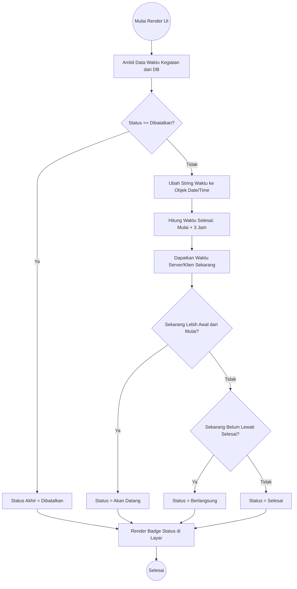
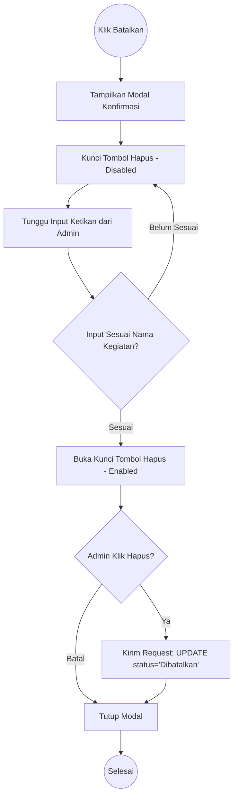

# Activity Diagrams

Dokumen ini memodelkan algoritma percabangan kondisi (conditional branching) menggunakan UML Activity Diagram.

## Kalkulasi Status Kegiatan (Event Status Calculation)

Aplikasi tidak mengizinkan Admin untuk memilih status kegiatan dari dropdown (misal: Selesai, Berlangsung). Semua dikalkulasi otomatis oleh sistem *Frontend* berdasarkan waktu aktual.

### Logika Konfirmasi Pembatalan (Cancellation Confirmation)

Ketika Admin mencoba membatalkan kegiatan, sistem meminta tingkat pengamanan ekstra untuk mencegah salah klik (*accidental click*).

