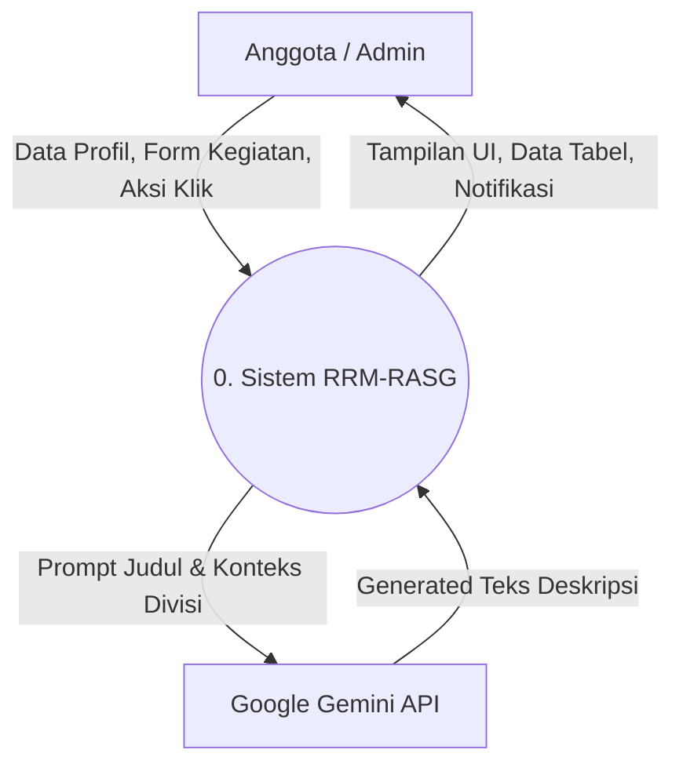
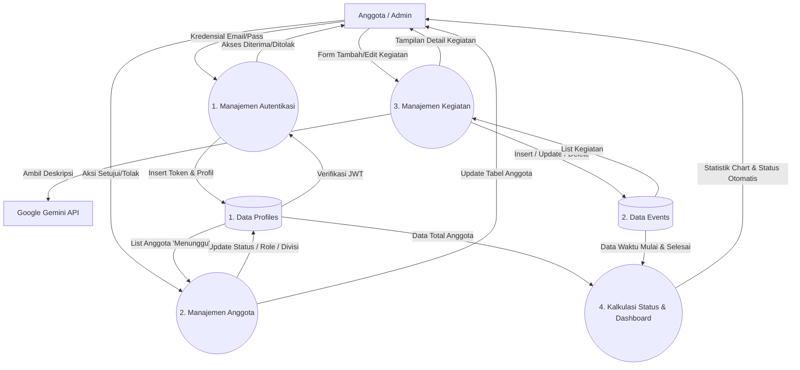

# Data Flow Diagram (DFD)

Dokumen ini memetakan aliran data dari entitas eksternal ke dalam sistem menggunakan pendekatan Data Flow Diagram yang divisualisasikan dengan flowchart.

## Level 0 (Context Diagram)

Menggambarkan sistem secara utuh dan interaksinya dengan entitas eksternal (pengguna dan layanan pihak ketiga).

## Level 1 (Proses Utama)

Membelah sistem menjadi proses-proses logis yang lebih terperinci dan memperlihatkan interaksi dengan penyimpanan data (Data Store).

