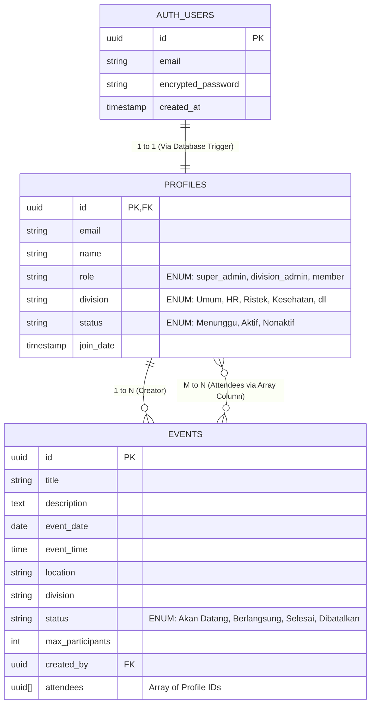

# Entity Relationship Diagram (ERD) & Data Dictionary

Dokumen ini memaparkan struktur tabel dan relasinya dalam basis data PostgreSQL.

## 1. Entity Relationship Diagram (ERD)

Sistem menggunakan skema autentikasi internal (`auth.users`) yang terikat kuat (tightly coupled) dengan skema aplikasi (`public.profiles` dan `public.events`).

## 2. Kamus Data (Data Dictionary)

### Tabel `profiles`
Merupakan tabel utama pengguna aplikasi. Baris data dibuat secara otomatis saat pengguna mendaftar melalui sistem Auth.
- **`id`** (`uuid`, Primary Key): Foreign key 1-to-1 ke `auth.users.id`.
- **`email`** (`text`): Email pengguna (diambil dari Auth).
- **`name`** (`text`): Nama pengguna.
- **`role`** (`text`): Peran pengguna. Digunakan untuk menentukan batasan akses di frontend dan database RLS. (Default: `member`).
- **`division`** (`text`): Divisi tempat anggota bergabung. Digunakan untuk memfilter UI dan keamanan data. (Default: `Umum`).
- **`status`** (`text`): Menentukan apakah pengguna diizinkan masuk ke dalam aplikasi. (Default: `Menunggu`).

### Tabel `events`
Menyimpan jadwal dan informasi kegiatan.
- **`id`** (`uuid`, Primary Key): Identifier unik kegiatan.
- **`title`**, **`description`**, **`location`**: Informasi dasar. Deskripsi bisa di-generate otomatis via AI.
- **`event_date`**, **`event_time`**: Waktu mulainya kegiatan.
- **`division`** (`text`): Penanda wilayah kegiatan. Hanya `division_admin` di divisi ini (atau `super_admin`) yang bisa memodifikasi baris ini.
- **`status`** (`text`): Status kegiatan. Hanya untuk flag "Dibatalkan". Status lain dikalkulasi *on-the-fly* di sisi *client*.
- **`created_by`** (`uuid`): Referensi profil si pembuat acara.
- **`attendees`** (`uuid[]`): Menggunakan tipe data Array native PostgreSQL untuk menyimpan daftar peserta, menghindari kerumitan pembuatan tabel persimpangan (junction table).
