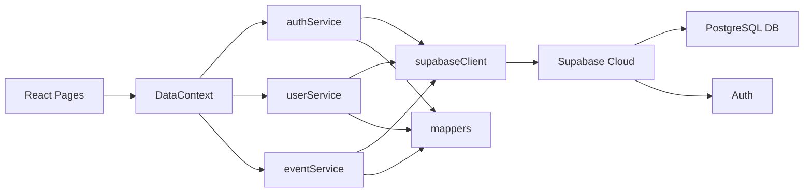

# Infrastruktur & Arsitektur Keamanan (Tech Stack & Security Architecture)

Dokumen ini menjelaskan tumpukan teknologi (Tech Stack) yang digunakan dan bagaimana keamanan tingkat basis data diimplementasikan untuk mencegah kebocoran wilayah administratif (Cross-Division Tampering).

## 1. Tech Stack (Tumpukan Teknologi)

Sistem RRM-RASG menggunakan arsitektur modern berbasis *Serverless* dan SPA (Single Page Application).

- **Frontend & UI**:
  - `React 18` dengan framework `Vite` untuk performa kompilasi yang cepat.
  - `TypeScript` untuk keamanan pengetikan kode statis.
  - `TailwindCSS` untuk desain responsif dan *utility-first styling*.
  - `Lucide React` untuk ikon.
  - `Recharts` untuk visualisasi data interaktif di Dashboard.
- **Backend & Database**:
  - `Supabase`: Platform Backend-as-a-Service (BaaS) berbasis PostgreSQL.
  - `Supabase Auth` (GoTrue) untuk manajemen autentikasi dan sesi JWT.
- **AI Integration**:
  - `@google/genai`: SDK untuk menyambungkan aplikasi dengan Google Gemini AI untuk keperluan otomatisasi *copywriting* deskripsi kegiatan.

## 2. Arsitektur Komponen Internal Aplikasi

Berikut adalah diagram alur antar layanan (Services) di dalam kode frontend React dan bagaimana mereka terhubung ke Supabase Cloud:



## 3. Arsitektur Keamanan (PostgreSQL Row Level Security)

Karena aplikasi berjalan tanpa layer *middleware* tradisional (Node.js/Express) dan langsung berkomunikasi dari *Frontend* ke *Database* (berkat fitur Data API dari Supabase), maka perlindungan akses data mutlak dikonfigurasikan di sisi Database. 

Sistem ini menerapkan **Row Level Security (RLS)** PostgreSQL.

### Konsep RLS
Setiap kueri dari Frontend akan dikirim bersama JWT Token pengguna. Database memecah token tersebut untuk mengetahui `auth.uid()`, lalu mencocokkannya dengan logika RLS (Kebijakan) sebelum memberikan atau mengubah data.

### Contoh Implementasi Keamanan (Security Policies)

**1. Keamanan Edit Profil: Hanya Admin Divisi Sendiri yang Boleh Mengedit**
Jika `division_admin` dari divisi "Ristek" mencoba mengubah status pengguna dari divisi "HR" via API, PostgreSQL akan memblokirnya karena kebijakan berikut:
```sql
CREATE POLICY "profiles: division_admin can update own division"
  ON profiles FOR UPDATE
  TO authenticated
  USING (
    (SELECT role FROM profiles WHERE id = auth.uid()) = 'division_admin'
    AND division = (SELECT division FROM profiles WHERE id = auth.uid())
    AND role != 'super_admin'
  );
```

**2. Keamanan Modifikasi Kegiatan: Tidak Ada Penyusupan Lintas Divisi**
Seorang Admin hanya boleh memperbarui (Update) kegiatan yang divisinya persis sama dengan divisi Admin tersebut (kecuali ia adalah Super Admin).
```sql
CREATE POLICY "events: admins can update"
  ON events FOR UPDATE
  TO authenticated
  USING (
    is_admin() AND (
      (SELECT role FROM profiles WHERE id = auth.uid()) = 'super_admin' OR
      division = (SELECT division FROM profiles WHERE id = auth.uid())
    )
  );
```

Dengan arsitektur ini, meskipun peretas (hacker) berhasil menemukan URL endpoint database dan mencoba mengirim kueri modifikasi berbahaya, tingkat database secara otonom akan membatalkan instruksi tersebut berdasarkan token autentikasi mereka.
