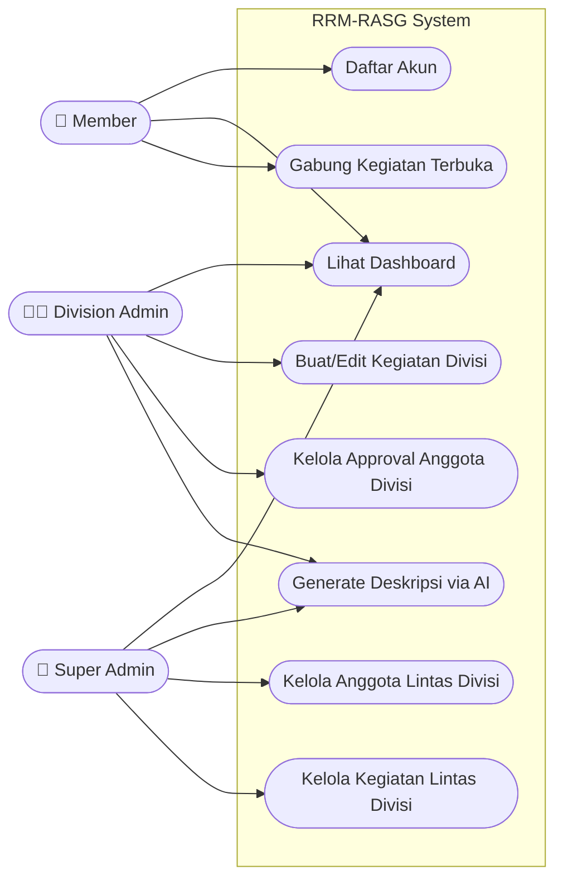

# UML Use Case Diagram

Diagram Use Case ini memetakan interaksi yang dapat dilakukan oleh tiga peran aktor (Member, Division Admin, Super Admin) ke dalam sistem.

### Penjelasan Aktor
1. **Member**: Aktor pengguna dasar yang hanya mengkonsumsi layanan (bergabung ke kegiatan yang sudah dibuat oleh admin).
2. **Division Admin**: Aktor administratif menengah. Mereka mengelola ruang lingkup kecil (hanya wilayah divisi mereka sendiri).
3. **Super Admin**: Aktor dengan tingkat *privilege* tertinggi yang tidak dibatasi oleh aturan isolasi divisi. Memiliki hak penuh untuk Read, Update, Delete di semua sumber daya aplikasi.
