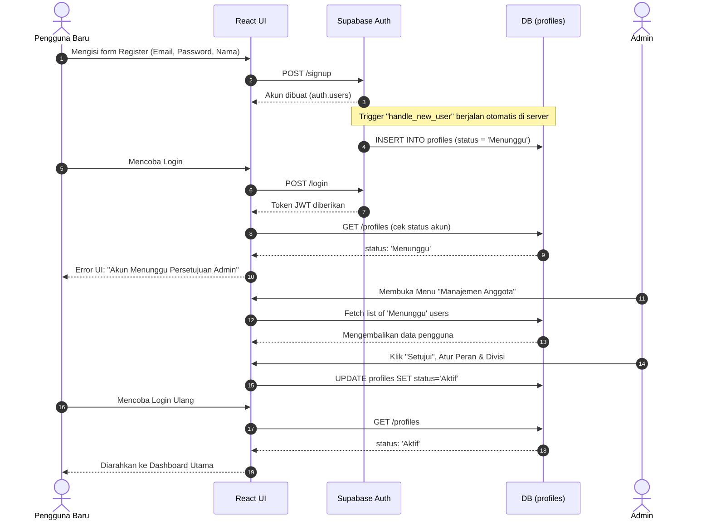

# User Flow & Sequence Diagrams

Dokumen ini menunjukkan bagaimana perjalanan alur (flow) seorang pengguna dari mulai pendaftaran hingga akhirnya bisa login ke dalam sistem.

## Alur Pendaftaran & Persetujuan (Registration & Approval Flow)

Karena alasan keamanan dan eksklusivitas keanggotaan, setiap pengguna yang baru mendaftar tidak bisa langsung masuk ke dalam aplikasi. Mereka akan ditahan dengan status `Menunggu` sampai seorang Admin menyetujuinya.

### Keterangan Langkah
1. **Langkah 1-3**: Pengguna mendaftar secara standar.
2. **Langkah 4**: Bagian terpenting dari arsitektur backend, di mana *database trigger* mengintersepsi pembuatan akun dan menyiapkan profil default.
3. **Langkah 5-8**: Lapisan pertahanan sistem. Meskipun *Authentication* berhasil, *Authorization* ditolak oleh aplikasi karena status masih `Menunggu`.
4. **Langkah 9-15**: Setelah campur tangan manusia (Admin) mengubah status di basis data, jalur login akan sepenuhnya terbuka.
