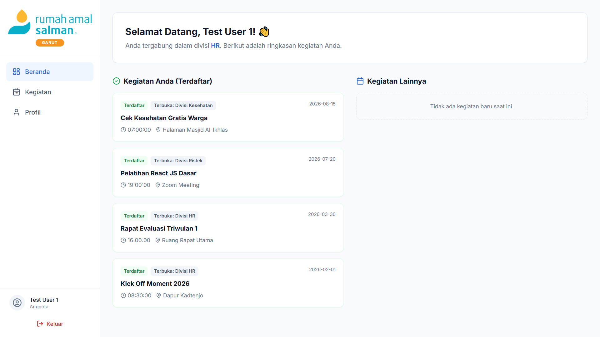

# Rumah Amal Salman — Production Deployment


This repository contains the production version of the Human Resource & Event Management system, fully integrated with a Supabase PostgreSQL backend and Google Gemini AI.

---

## 🌟 Goals

- Manage volunteer profiles, event CRUD operations, and attendance securely in production.
- Enforce Role-Based Access Control (RBAC) securely at the database level using Supabase Row Level Security (RLS) policies.
- Automate event statuses and AI description generation.

## 🛠 System Architecture

- **Frontend**: React 18, Vite, TypeScript, Tailwind CSS, Lucide React (Icons), and Recharts (Charts).
- **Backend/BaaS**: Supabase
  - **Authentication**: Supabase GoTrue Auth (email/password signup & login).
  - **Database**: PostgreSQL with custom functions and triggers to automatically sync user profiles upon authentication signup.
  - **Security**: Row Level Security (RLS) policies to protect data boundaries at the API level (preventing unauthorized read/write access).
- **AI Integration**: Google Gemini AI API (`@google/genai`) for automatic description generation.

---

## 📁 Database Schema (Supabase PostgreSQL)

### 1. Enums
- `role`: `'super_admin'`, `'division_admin'`, `'member'`
- `division`: `'HR'`, `'Lingkungan'`, `'Media'`, `'Ristek'`, `'Kesehatan'`, `'Pendidikan'`
- `user_status`: `'Aktif'`, `'Nonaktif'`, `'Menunggu'`
- `event_status`: `'Upcoming'`, `'Ongoing'`, `'Completed'`, `'Cancelled'`

### 2. Tables

#### `profiles`
Tracks user details and syncs with Supabase Auth:
- `id` (UUID, primary key, references `auth.users`)
- `name` (text, non-null)
- `email` (text, non-null)
- `role` (role enum, default `'member'`)
- `division` (division enum, default `'HR'`)
- `status` (user_status enum, default `'Menunggu'`)
- `created_at` / `updated_at` (timestamps)

#### `events`
Tracks organizational events:
- `id` (UUID, primary key)
- `name` (text)
- `description` (text)
- `event_date` (timestamp with time zone)
- `location` (text)
- `status` (event_status enum, automated or manual)
- `organizer_division` (division enum)
- `max_participants` (integer)
- `target_division` (division enum, nullable - NULL indicates open to all divisions)
- `created_by` (UUID, references `profiles.id`)
- `created_at` / `updated_at` (timestamps)

#### `event_registrations`
Tracks members registering for events:
- `id` (UUID, primary key)
- `event_id` (UUID, references `events.id` with cascade delete)
- `user_id` (UUID, references `profiles.id` with cascade delete)
- `registered_at` (timestamp with time zone)

---

## 🔒 Row Level Security (RLS) Policies

To secure the production database, the following PostgreSQL RLS rules are configured:

1. **Profiles**:
   - Users can read all profiles in their same division (or all profiles if they are super_admin).
   - Only super_admin and division_admin (within their division) can update user profiles (e.g., status approval, roles, division changes).
2. **Events**:
   - Anyone authenticated can read events.
   - Only super_admin and division_admin can insert, update, or delete events.
3. **Event Registrations**:
   - Members can insert/delete their own registration rows.
   - Admins can read all registrations to view event attendance.

---

## 🚀 Production Deployment Setup

### 1. Supabase Project Setup
1. Create a project at [supabase.com](https://supabase.com).
2. Go to the SQL Editor and execute `supabase/schema.sql`. This sets up:
   - All custom tables, enums, triggers, and functions.
   - The trigger `on_auth_user_created` which automatically creates a profile row in the `profiles` table when a user registers via Supabase Auth.
   - All necessary RLS policies.
3. (Optional) Run `supabase/seed_dummy.sql` if you want pre-populated dummy events and member records for staging.

### 2. Environmental Variables Configuration
Configure your production build environment (e.g., Vercel, Netlify, Render) with the following environment variables:

```env
VITE_SUPABASE_URL=https://your-supabase-project.supabase.co
VITE_SUPABASE_ANON_KEY=your-supabase-anon-key-here
VITE_GEMINI_API_KEY=your-gemini-api-key-here
```

*Note: For Vite, these variables must be prefixed with `VITE_` to be bundled into the production static files.*

### 3. Build and Deploy Frontend
Build command:
```bash
npm run build
```
The output directory will be `dist`, which contains optimized HTML, CSS, and JS assets ready to be hosted on static hosting services like Vercel or Netlify.
